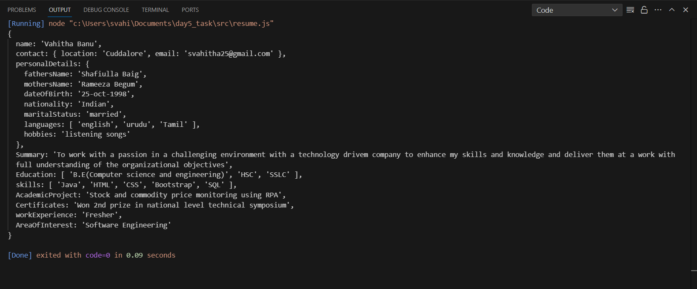
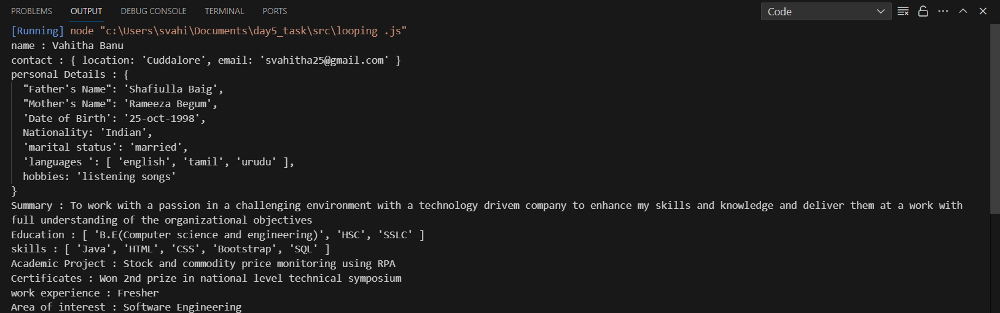

This repository shows the output screenshots:

Question1:

- Create your own resume data in JSON format

 Question2:

 - For the above JSON iterate over all for loops (for, for...in , for... of , for.... each)

